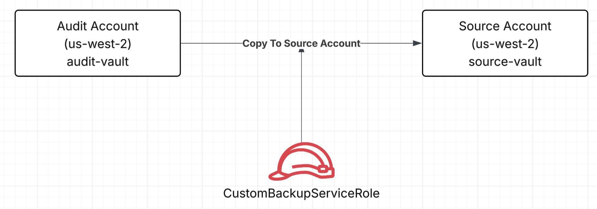
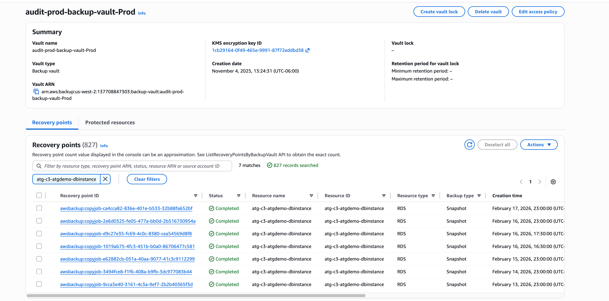
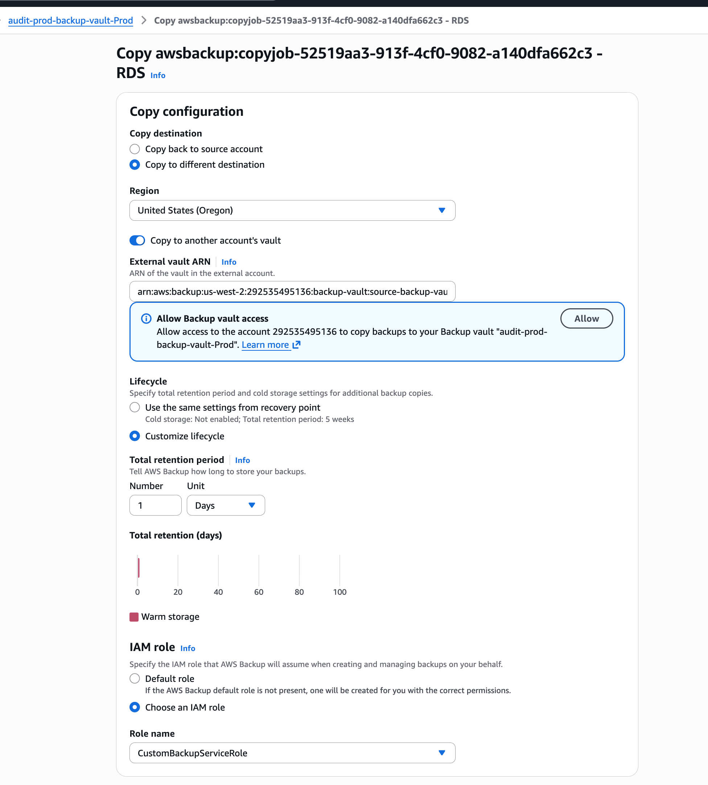
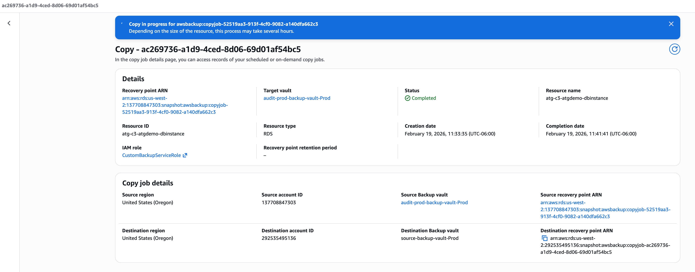
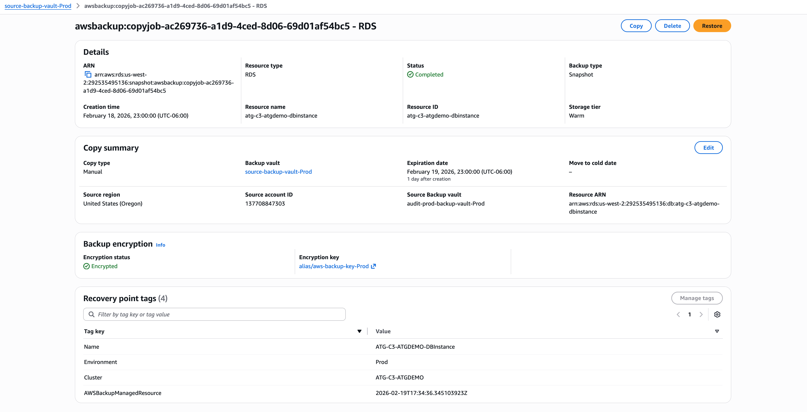
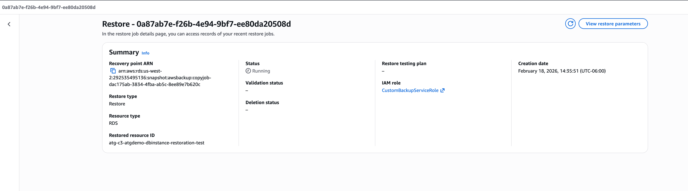

# HOAM Backup Strategy Infrastructure

## Overview

> The following infrastructure has been created to have a backup strategy for the production running databases and clusters.

### Infrastructure Overview

#### Backup Policy

The backup policy has been created at the organizations level. Using the associa-billing account (158423647223) we have deployed the following backup policy over the production Organizational Unit:

* Backups will be placed in the **source-backup-vault-Prod** backup vault with 7 days of retention
* There will be an automatic copy job that will move the backup snapshots to the us-east-1 region to the **intermediate-backup-vault-Prod** vault
* The **intermediate-backup-vault-Prod** will store snapshots for 35 days.
* The role specified is a custom role deployed on each prod account named **CustomBackupServiceRole**

#### Backup Resources

The strategy for backing up requires a centralized place to have the backups in case of a disaster. The account to store the backups will be the Audit Account (137708847303). Each production account will have a local backup but also we will place anothe copy in the audit account.

The following diagrams shows the infrastructure and resources used to achieve this:

On Each Production Account:
* We have **source-backup-vault-Prod** and **intermediate-backup-vault-Prod**. We use two backup vaults in order to address issues copying snapshots cross-account if they are using the AWS Managed Key. 

* There are two lambdas working in order to monitor the jobs to trigger the copy cross account to the audit account.

On the Audit Account:

* We have the target vault where the backups will be stored.

#### Cloudformation Templates

On the associa-billing we have deployed cloudformation stacksets:

* [hoam-custom-backup-role-prod](https://us-west-2.console.aws.amazon.com/cloudformation/home?region=us-west-2#/stacksets/hoam-custom-backup-role-prod:03c21087-af78-4b18-9090-fe342b7d1c57/info?permissions=service): The role has been deployed across the production accounts to allow the permissions over to AWS Backup

* [hoam-prod-backup-vault](https://us-west-2.console.aws.amazon.com/cloudformation/home?region=us-west-2#/stacksets/hoam-prod-backup-vault:0a68aeb3-6157-4343-b277-49680cccc2fd/info?permissions=service): The encrypted vault used to create snapshots for clusters and dbs.

* [hoam-prod-intermediate-vault](https://us-west-2.console.aws.amazon.com/cloudformation/home?region=us-west-2#/stacksets/hoam-prod-intermediate-vault:07354ff6-82bf-456d-9a4c-a8424ce3402e/info?permissions=service): The intermediate vault created on each account to solve ten encryption issue.

---

# Restoration of snapshot in the Audit Account

Audit account is used to store snapshots for databases in case the local backups are not working properly. To restore the snapshots we need to follow the process:

The idea is to copy snapshots stored from the audit account back into a target vault. On each Production account we have a **source vault** which has the policy setup to allow access from the audit account to copy back a snapshot from the Audit account.

## Restoration steps:

Lets take as an example the database **atg-c3-atgdemo-dbinstance**, we will restore it back to the source account int the **source vault**, we will use this arn: **arn:aws:backup:us-west-2:292535495136:backup-vault:source-backup-vault-Prod** to restore from the **audit vault** 

* Log in into the Audit Account (137708847303)

* Search for the backup in the region us-west-2 in the vault: **audit-prod-backup-vault-Prod**

* Now select the snapshot and perform the copy action so we can have the snapshot in the source vault. Select the following settings:

    * Select **Copy to different destination**
    * Region **us-west-2**
    * Enable the option **Copy to another account's vault**
    * Add the ARN for the source account's vault: **arn:aws:backup:us-west-2:292535495136:backup-vault:source-backup-vault-Prod**
    * For the IAM role choose: **CustomBackupServiceRole**

* Start the copy process and wait for it to complete.

* Log in back to the source account, search for the snapshot copied from the audit account and get ready to restore it back with the settings required

* Restore the snapshot using the **CustomBackupServiceRole**, add all the configurations needed to be restored and start the restoration process.

