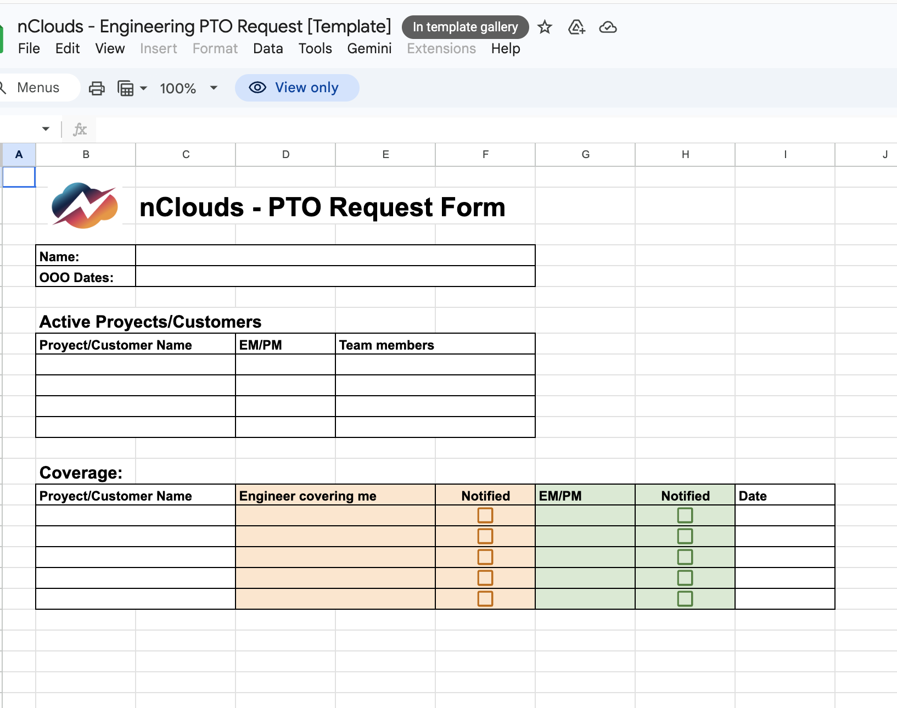
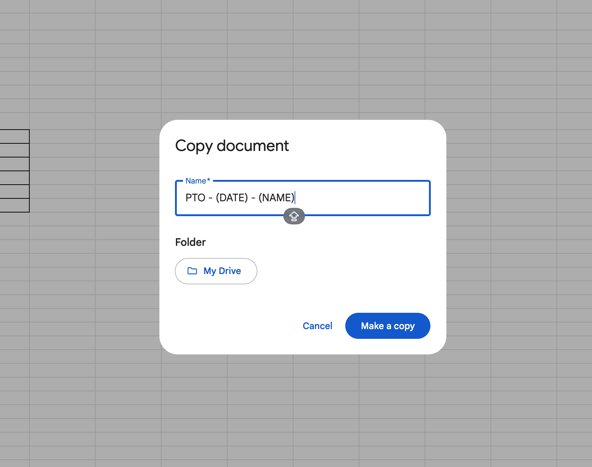
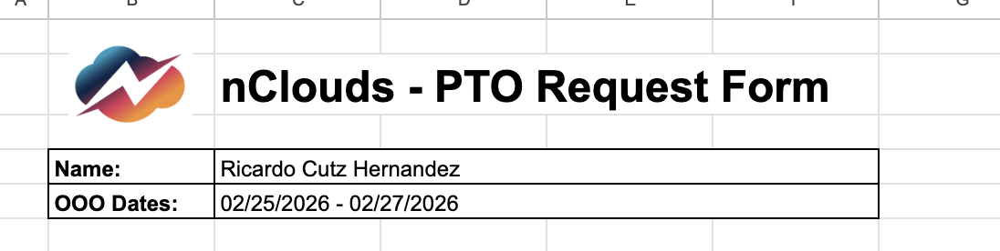
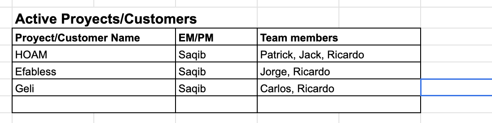
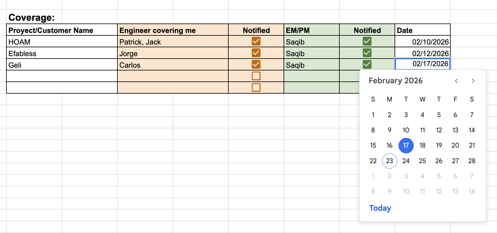
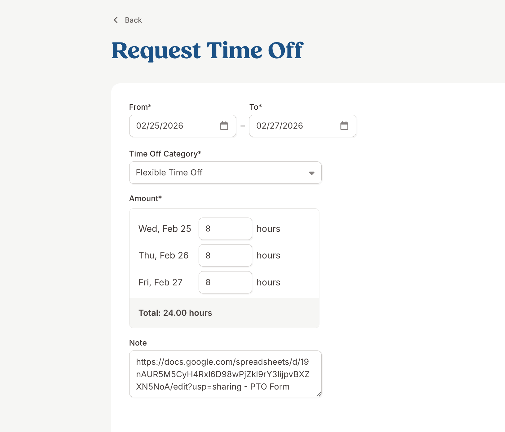

# PTO Requests Process

To be able to request planned time off please follow the instructions below:

## PTO Form

* To start your PTO request, please fill up the following [form](https://docs.google.com/spreadsheets/d/1J5qqxelSZTntO1l4SE9YvUaDF-0V1s3WAZpYP4JuS7M/edit?gid=0#gid=0), this will require the information needed to have proper coverage for clients:

* Create a Copy of the form into your own Drive to be able to edit the form. 

* Fill the information required as follows:

* Add the projects you are actively working on and the team members you are working those projects:

* For the **Coverage** section we need to add all the information for each project:

    * **Engineer Covering Me** and **Notified**: Here you need to reach out to your team members to sync with them to let them know you will be requesting some PTO and you will require some help to cover client's questions/tasks during your PTO time.

    * **EM/PM** and **Notified**: You also need to let the PM of each project know, so he can inform the client (if needed) and have proper communication.

## Sending your Bamboo Request:

* Fill your information through Bamboo HR:

* In the *Notes* section, add a shared link to your form so we can review the form along with your PTO Request.